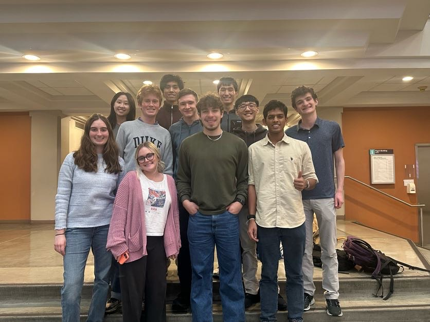

# Duke University Debating Society -- Website

A small, self-contained website whose **content lives in plain text files** so
exec can update pages without touching any HTML, CSS, or code.

---

## For exec: putting changes on the live site

You do **not** need your own GitHub account. Use the shared Duke Debate GitHub
login. Username and password are in this Google Doc (Duke Google account
required):

**[GitHub login](https://docs.google.com/document/d/1olHeE1wVcUVGCjA14kLN9Y37e3hgpkDuugDOpktYdjE/edit?usp=sharing)**

Log in at [github.com](https://github.com), then open
**[this repository](https://github.com/DukeDebate/dukedebate.github.io)**.
Pushing to the `main` branch rebuilds the site and publishes it automatically.
Wait a minute or two, then refresh the live site at
**[dukedebate.github.io](https://dukedebate.github.io/)** (hard-refresh if you
still see the old version). A custom domain (likely duke-debate.com) can be
added later in GitHub Settings -> Pages; the site already uses root-relative
URLs, so that switch will not require rewriting links.

**Before you change anything:** if someone else may have edited the site,
update your copy first (`git pull` locally, or reload the GitHub page). Two
people editing the same file at once can overwrite each other.

### Easiest: edit or add files on GitHub

No clone, no terminal. Good for copy edits, swapping a photo, or dropping
images into a gallery folder.

1. On GitHub, open the file (for example `content/home.md` or
   `assets/photos/`).
2. To **edit text:** click the pencil, change the words, and commit directly
   to `main` with a short message ("Update join dates").
3. To **add files** (photos, logos, headshots): open the folder, click
   **Add file -> Upload files**, drop the files in, and commit to `main`.
4. Gallery photos only need to land in the folder named in `content/photos.md`
   (currently `assets/photos/`). You do not also have to list them in Markdown.

Do not put the GitHub password, or any other secrets, in this repository.

### Local copy: clone, pull, edit, push

Use this if you want to preview with `./serve.sh` before the change goes live.

**First time** (clone = download the repo onto your computer):

```bash
git clone https://github.com/DukeDebate/dukedebate.github.io.git
cd dukedebate.github.io
```

Then follow [Quick start](#quick-start-run-it-locally) to preview.

**Every time you sit down to edit:**

```bash
git pull                  # get everyone else's latest changes first
# ... edit files, preview with ./serve.sh ...
git add -A
git commit -m "Short description of what you changed"
git push                  # publishes to the live site
```

`git pull` before you start. `git push` when you are done. If `git push` is
rejected, run `git pull` (or `git pull --rebase`), fix any conflicts, then
push again.

---

## How the site works

Plain HTML, CSS, and vanilla JavaScript: no frameworks and nothing to install
beyond Node.js. Your text files are turned into finished web pages by one
small script (`build.mjs`).

Because the pages are built ahead of time, the words are already in the page
when it arrives. The site works fine with JavaScript switched off; JavaScript
only adds the extras (the dark/light toggle, the collapsing menu, and the photo
gallery lightbox).

---

## Quick start (run it locally)

One command builds the pages and then serves them:

```bash
./serve.sh          # builds, then starts on port 8000
./serve.sh 9000     # or pick your own port
```

Then open **http://localhost:8000/** in your browser. Press `Ctrl+C` in the
terminal to stop.

**Re-run `./serve.sh` after you edit anything in `content/`**. That's what
rebuilds the pages. (Editing a file does not change the site until you do.)

You need **Node.js** installed (that's what builds the pages) and **Python 3**
(that's what serves them). The script checks for both and tells you if one is
missing.

Optionally install **exiftool** (`brew install exiftool`) so the build can
strip GPS and camera metadata from images before they are published.

> **Why can't I just double-click `index.html`?** Because that file isn't the
> site. Your pages get built into a `dist/` folder, and *that* folder is the
> website. Opening `index.html` directly just shows a short note pointing you
> back here. There's nothing to fix -- run `./serve.sh` instead.

---

## Editing page text

Every page's words live in a matching text file inside the `content/` folder:

| Page on the site | File to edit |
| --- | --- |
| Home | `content/home.md` |
| About | `content/about.md` |
| Join | `content/join.md` |
| Competition | `content/competition.md` |
| Leadership | `content/leadership.md` |
| Alumni | `content/alumni.md` |
| Donate | `content/donate.md` |
| Photos | `content/photos.md` |
| Contact | `content/contact.md` |

Site name, header brand text, footer blurb, and colors live in
**`content/site.yaml`**. Footer social icons live in **`content/socials.txt`**.
Menu order lives in **`content/nav.txt`**.

Open any of these in a normal text editor (Notepad, TextEdit, VS Code --
anything), make your changes, and save. Then re-run `./serve.sh` and refresh
the page in your browser to see them.

### The header block (front matter)

Each file starts with a small block between two `---` lines. It sets the big
title and the sentence underneath it:

```
---
title: About Duke Debate
subtitle: Argumentation, persuasion, and competitive debate since 1897.
---
```

Change the words after `title:` and `subtitle:`. Keep the two `---` lines.

### Formatting cheat sheet (Markdown)

The body text uses **Markdown**, a simple way to format plain text. You only
need a few things:

| To make this | Type this |
| --- | --- |
| A big section heading | `## My Heading` |
| A smaller heading | `### Smaller Heading` |
| **Bold text** | `**bold text**` |
| *Italic text* | `*italic text*` |
| A bullet list | Start each line with `- ` |
| A numbered list | Start each line with `1. `, `2. `, ... |
| A link | `[link text](https://example.com)` |
| A link to another page | `[Join page](#/join)` |
| A quote / callout | Start the line with `> ` |
| A divider line | A line with just `---` |
| `Inline code` | Wrap words in backticks: `` `like this` `` |
| A table | See any existing file for the `\| a \| b \|` pattern |
| A big button | `[[button: Label -> #/join]]` (see below) |
| A two-column split | `::: split ... \|\|\| ... :::` (see below) |
| An expandable section | `::: accordion Title ... :::` (see below) |
| A logo grid | `::: logos` with `` lines (see below) |
| A photo gallery | `::: gallery assets/photos/...` (see below) |

Multi-line quotes work too: start **every** line with `> `, and the line
breaks are kept. Leave a blank `>` line to start a new paragraph inside the
quote. (Example: the mailing address on the Contact page.)

Tips:
- Leave a blank line between paragraphs.
- To link to another page on this site, use the `#/pagename` form, e.g.
  `[Join us](#/join)`. **This is still exactly what you type.** When the site is
  built, those links are converted automatically into real addresses
  (`#/join` becomes `/join/`, and `#/home` becomes the home page). You never
  type the converted form yourself -- keep using `#/pagename` everywhere,
  including inside buttons and split sections.
- If you mistype a page name, the build prints a warning naming the file and the
  bad link, and leaves that one link doing nothing. The rest of the site still
  builds and publishes normally.
- When in doubt, copy the style of an existing file -- they're all examples.

---

## Adding a new page

**Drop one file into `content/` and you have a new page.** No code to edit, no
list to register it in.

Say you want a Sponsors page:

1. Create **`content/sponsors.md`**. The file name (without `.md`) becomes the
   web address, so this one lands at **`/sponsors/`**. Use lowercase and no
   spaces -- `sponsors.md`, not `Our Sponsors.md`.
2. Start it with the usual header block, then write the body:

   ```
   ---
   title: Our Sponsors
   subtitle: People and organizations who support the team.
   ---
   ## Thank you

   We are grateful to our sponsors. See the [Join page](#/join) to get involved.
   ```
3. Re-run `./serve.sh`. The page is live at `http://localhost:8000/sponsors/`
   and a **Sponsors** link is already in the site navigation.

That's the whole process. The nav link text is the file name with its first
letter capitalized (`sponsors.md` -> "Sponsors").

### Choosing where it sits in the menu

A brand-new page's link is added at the **end** of the menu. To put it
somewhere specific, open **`content/nav.txt`** and add its name on its own line
where you want it:

```
home
about
sponsors      --> add this line here and the link moves here
join
```

The build prints a friendly note for any page that isn't listed in `nav.txt`,
reminding you its link went to the end. It's only a note -- the page is still
published and works normally either way. Editing `nav.txt` is optional and only
ever about **order**.

Want the link to read something other than the file name? Add `|` and your
wording:

```
sponsors | Our Partners
```

Want a link that goes **off this site** (a shared Drive folder, an external
form, etc.)? Put the full `http://` or `https://` URL in the first field and a
label after `|`:

```
https://example.com/team-folder | Team Resources
```

External links open in a new tab and show a small `^` marker. They are never
highlighted as the "current page".

### Removing or renaming a page

- **To remove** a page: delete its `content/<name>.md` file (and its line in
  `nav.txt`, if it has one). Re-run `./serve.sh`.
- **To rename** a page's address: rename the file. Remember its web address
  changes with it, so update any `#/oldname` links in other files -- the build
  warns you about ones you miss.
- If `nav.txt` lists a page whose file doesn't exist, the build warns and simply
  skips that link, so a leftover line can't break the site.

---

## Split sections, buttons, accordions, logos & galleries

Extra building blocks that make a page more visual. All work in **any**
`content/*.md` file and need no HTML.

### Big call-to-action button

Turn a link into a large, prominent button with this one-liner:

```
[[button: Join the team -> #/join]]
```

- Text before the `->` is the **label** shown on the button.
- Text after the `->` is where it **goes**: another page (`#/join`) or a full
  web address (`https://...`, which opens in a new tab).
- Put it on its own line (with a blank line above and below) for a standalone
  button. There are live examples on `content/home.md`.

### Split section (content on one side, image on the other)

Wrap two blocks between `::: split` and `:::`, separated by a line with just
`|||`. The first block is the left column, the second is the right column:

```
::: split
## Debate at Duke
Normal Markdown here -- paragraphs, **bold**, lists, links, anything.

- point one
- point two
|||

:::
```

- On wide screens the two columns sit **side by side**; on phones they
  **stack** automatically (left column first).
- To put the image on the **left** instead, add the word `flip`:
  `::: split flip`.
- Either side can hold any Markdown, not just an image -- two columns of text
  work fine too. See `content/home.md` for working examples.
- **Leaving out the `|||`** is fine: with no second column the block simply
  renders as one full-width column (handy for a bordered call-out). It will
  *not* leave a blank half-width gap.
- A mistyped fence (a stray `:::`, or `::: something-else` that isn't a known
  directive) is ignored and just disappears -- it never breaks the page.

### Accordion (expandable section)

Wrap a title and body between `::: accordion Title` and `:::`. Clicking the
title expands or collapses the body. Works without JavaScript (uses the
browser's built-in disclosure control), so it stays usable with JS off and
with a keyboard.

```
::: accordion Do I need prior debate experience?
No. Tryouts are open to students who never debated in high school. We teach
British Parliamentary debate after you join.
:::
```

The body can be normal Markdown: paragraphs, links, **bold** / *italic*,
lists, and so on. Useful for FAQs and for long archives you don't want fully
open by default:

```
::: accordion Recent results
- WUDC 2026 -- Open Semifinalists
- North American BP -- several breaking teams
:::
```

Put each accordion in its own `::: ... :::` block. Multiple on one page is
fine; each opens and closes on its own.

### Logo grid

Wrap a list of Markdown images between `::: logos` and `:::` to show
organization or company logos in a responsive grid. Aspect ratios are
preserved; logos sit on a white plate so transparent marks stay readable in
both themes.

```
::: logos


:::
```

- Put logo files in `assets/logos/` (PNG, JPG, WebP, or SVG all work).
- The text in `![...]` is the **alt text** (important for accessibility) --
  usually the organization name.
- Add another logo later by adding another image line.
- See the Alumni page (`content/alumni.md`) for a live example.

### Photo gallery

Point a gallery at a folder under `assets/`; the build expands it to one image
per file (sorted by filename). Clicking a photo opens a lightbox when
JavaScript is available; without JS the grid still shows. Multiple galleries
on one page are fine -- each keeps its own set for previous/next.

```
## Photo Gallery

::: gallery assets/photos/
:::
```

You can also point at a subfolder if you want separate galleries:

```
::: gallery assets/photos/gallery/tournaments
:::
```

- Put image files in that directory (JPG, PNG, WebP, GIF, or SVG). Subfolders
  are not scanned -- only files sitting in that folder.
- Alt text / captions are derived from each filename (`team-trip.jpg` ->
  "Team Trip").
- You can still list `` lines inside `::: gallery` / `:::` with
  no directory path if you need custom captions or a mixed set.
- See `content/photos.md` for the live example.

There is no separate photos manifest -- galleries live in the Markdown like
everything else.

---

## Site name, brand & colors (`content/site.yaml`)

Branding and the color palette are **not** hardcoded in the build script.
Edit `content/site.yaml`:

```yaml
name: Duke University Debating Society
short_name: Duke Debate
brand_name: Duke Debate
description: "Founded in 1897, Duke Debate competes in British Parliamentary debate..."
footer_note: "Student organization at Duke University"

colors:
  dark:
    accent: "#0577B1"
    bg: "#010d24"
    # ...
  light:
    accent: "#012169"
    bg: "#F3F2F1"
    # ...
```

- **name** -- full site name (page titles, eyebrow, footer).
- **brand_name** -- header wordmark ("Duke Debate").
- **short_name** -- used if `brand_name` is missing.
- **description** -- default meta description when a page has no subtitle.
- **footer_note** -- small line under the footer brand.
- **colors.dark** / **colors.light** -- CSS variables (`accent` ->
  `--color-accent`, `bg_raised` -> `--color-bg-raised`, etc.).
  `glow_accent` / `glow_secondary` also set the soft background washes.

The header shows **Duke Debate** only (no subtitle, no logo mark). The tab
icon is a navy "D", written to `dist/favicon.svg` on every build.

Re-run `./serve.sh` after edits. The build injects these as a small
`<style id="site-theme">` block so you do not need to hand-edit `css/style.css`
for a re-skin. Structural CSS (layout, type scale, spacing) still lives in
`css/style.css`.

### Type pairing

Headings and brand use **EB Garamond**; body and UI use **Open Sans**. Font
files are self-hosted under `assets/fonts/` and loaded via `css/fonts.css`, so
the site does not depend on Google Fonts at runtime.

---

## Adding, removing, or reordering photos

Photos belong in directory-backed galleries (see [Photo gallery](#photo-gallery)
above). To add a photo: drop the file into the gallery folder named in the
Markdown (e.g. `assets/photos/`). To remove one, delete the file. To regroup,
move files between folders or change the directory on the `::: gallery` line.
Sort order follows filenames.

The build strips image metadata (EXIF/IPTC/XMP) from `assets/` via `exiftool`
when it is installed -- install it locally (`brew install exiftool`) so your
machine and CI keep published images clean.

> Empty gallery folders are fine until real images land -- the section simply
> shows no photos.

---

## Menu order (`content/nav.txt`)

The order of the links across the top of the site is driven by a plain text
file, `content/nav.txt`. One entry per line, top to bottom:

```
home
about
join
https://example.com/team-folder | Team Resources
```

- Each line is either a **file name from `content/` without the `.md`** --
  `about` means `content/about.md`, which is published at `/about/` -- **or** a
  full `http://` / `https://` URL for an off-site link.
- For internal pages, the link text is that name with its first letter
  capitalized. To use different wording, add `| Your Label`, e.g.
  `photos | Photo Gallery`.
- For external URLs, a label after `|` is **required** (e.g.
  `https://example.com | Team Resources`). External links open in a new tab,
  show a small `^` marker, and are never marked as the current page.
- Lines starting with `#` are comments (ignored), and blank lines are fine.

To **reorder** the menu, move lines up or down. `home` is first simply because
it's the first line.

You do **not** need to touch this file to add a page -- see
[Adding a new page](#adding-a-new-page). It only controls order (and optional
external links). Two safeguards: a page missing from this list is still
published (its link goes to the end, with a note), and a line naming a file
that doesn't exist is skipped with a warning.

---

## Changing the color scheme

Prefer **`content/site.yaml`** (see above) for palette changes -- that is the
supported path for re-skinning.

`css/style.css` still defines fallback values and all layout/type rules. A few
colors are **deliberately** left as fixed values because they must stay dark in
*both* themes -- the full-screen photo lightbox and its text, and the caption
strip that slides over a photo. They're commented where they appear; leave them
unless you're restyling those specific overlays.

### The dark / light toggle

There's a sun/moon button that switches between the light and dark themes.

- **Where it is:** on wide screens it sits at the top-right of the header. On
  narrow screens (where the menu collapses to a hamburger) it moves *inside*
  that menu as a labelled "Switch to dark/light theme" row. It's the same
  button either way, always reachable by mouse or keyboard.
- **First visit:** the site follows the visitor's **operating-system**
  preference (light or dark) automatically.
- **Clicking the button** switches themes and **remembers** the choice in the
  browser for next time (stored under the key `theme`).
- After an explicit choice, the site stops following the OS setting until the
  visitor clears their browser storage. Before any choice, changing the OS
  setting updates the site live.

No configuration needed -- it works out of the box.

---

## Social links

The row of social icons in the footer is driven by a plain text file,
`content/socials.txt`. Each line is:

```
name | url
```

- **name** -- the network. These names get an icon automatically: `Email`,
  `Instagram`, `YouTube`, `GitHub`, `LinkedIn`. Any other name still works --
  it shows as a small text label.
- **url** -- where the icon links. Use a full `https://...` address, or a
  `mailto:you@example.com` address for Email.

Example (matches the current site):

```
Email     | mailto:nathanael.ren@duke.edu
Instagram | https://www.instagram.com/duke.debate/
```

To **add** a link, add a line. To **remove** one, delete its line. To
**reorder**, move lines up or down. If the file is empty or missing, the footer
simply shows no social row (no error). Icons are built into the site (inline
SVG), so they need no internet connection and adapt to light and dark themes
automatically.

You only need to change `socials.txt` when the public contact channels change
(new Instagram handle, shared inbox, etc.). Branding colors and the site name
are in `site.yaml`, not here.

---

## Project structure

```
org-website/
|-- content/              # EDIT THESE for page text & site settings
|   |-- home.md ... contact.md
|   |-- site.yaml         # Site name, brand text, footer, colors
|   |-- nav.txt           # Menu order (page slug or https URL per line)
|   `-- socials.txt       # Footer social links (name | url)
|-- assets/
|   |-- favicon.svg       # Navy "D" tab icon (also copied to dist/favicon.svg)
|   |-- photos/           # Page photos; ::: gallery can point here
|   |-- leadership/       # Leadership headshots
|   |-- logos/            # Logo grid images
|   `-- fonts/            # Self-hosted EB Garamond + Open Sans (.woff2)
|-- css/
|   |-- fonts.css         # @font-face rules for the type pairing
|   `-- style.css         # Layout & type; palette fallbacks (override via site.yaml)
|-- build.mjs             # Builds content/ into dist/
|-- js/
|   |-- render.mjs        # Turns Markdown into HTML (used by the build)
|   |-- app.js            # Theme toggle + collapsing menu (+ gallery import)
|   `-- gallery.mjs       # Lightbox for ::: gallery grids
|-- dist/                 # THE BUILT WEBSITE (do not edit by hand)
|-- .github/workflows/
|   `-- deploy.yml
|-- index.html            # Not the site -- note pointing at ./serve.sh
|-- serve.sh
`-- README.md
```

The two folders that matter day to day: you edit **`content/`**, and the build
produces **`dist/`**.

---

## Deploying (putting it online)

The site is published by **GitHub Pages** from
[DukeDebate/dukedebate.github.io](https://github.com/DukeDebate/dukedebate.github.io).
Every push to the **`main`** branch rebuilds the pages and puts them live at
**https://dukedebate.github.io/**. You don't run a build yourself.

The recipe lives in `.github/workflows/deploy.yml`. It installs nothing (the
build needs only Node.js), runs `node build.mjs`, and publishes the resulting
`dist/` folder.

**One-time setup** on a fresh repo:

1. Go to **Settings -> Pages**.
2. Set **Source** to **GitHub Actions**.
3. Push to `main`. Watch it under the repo's **Actions** tab -- a green check
   means it's live at https://dukedebate.github.io/.

Notes:

- A **custom domain** (the plan is duke-debate.com) goes in Settings -> Pages,
  not in a file in this repo. Artifact-based publishing does not preserve a
  `CNAME` file. Root-relative asset URLs (`/css/...`, `/assets/...`) already
  match both dukedebate.github.io and a future apex domain.
- Unknown addresses show the site's own styled "Page not found" page
  (`dist/404.html`, built automatically).
- `dist/` is deliberately **not** committed -- it's rebuilt from `content/` on
  every push, so there's nothing to keep in sync.
- To publish from a differently-named branch, change the branch name in
  `deploy.yml`. It must match, or nothing happens (with no error).

Other static hosts (Netlify, Cloudflare Pages, S3, Apache/Nginx) work too --
run `node build.mjs` and upload the **`dist/`** folder, not the project folder.

---

## Notes & limitations

- This is a **prototype**. The Markdown renderer supports the common basics
  listed in the cheat sheet, not the full Markdown specification.
- Content is escaped before rendering as a basic safety measure, but this is a
  demo, not a hardened production CMS.
- **Link safety:** links, buttons, and social icons only accept `http://`,
  `https://`, `mailto:`, in-site `#/page` routes, and ordinary file paths.
  Anything else (for example a `javascript:` URL) is ignored and the text is
  shown plain, so a pasted link can't run code. You don't need to do anything --
  just know that an odd-looking link may render as text instead of a link.
- Contact emails and the Instagram handle come from the content files /
  `socials.txt` -- update those when officers or accounts change.
- **Mistakes show up in the terminal**, not on the page. When you run
  `./serve.sh`, the build prints a line per page plus any warnings (a mistyped
  `#/link`, a `nav.txt` line with no matching file). It's worth a glance. A
  warning never stops the site from being built.
